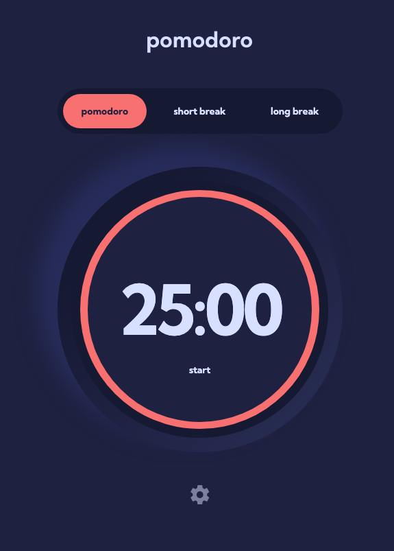

# Frontend Mentor - Pomodoro app solution

This is a solution to the [Pomodoro app challenge on Frontend Mentor](https://www.frontendmentor.io/challenges/pomodoro-app-KBFnycJ6G). Frontend Mentor challenges help you improve your coding skills by building realistic projects. 

## Table of contents

- [Overview](#overview)
  - [The challenge](#the-challenge)
  - [Screenshot](#screenshot)
  - [Links](#links)
- [My process](#my-process)
  - [Built with](#built-with)
  - [What I learned](#what-i-learned)
- [Author](#author)
- [Acknowledgments](#acknowledgments)

## Overview

### The challenge

Users should be able to:

- Set a pomodoro timer and short & long break timers
- Customize how long each timer runs for
- See a circular progress bar that updates every minute and represents how far through their timer they are
- Customize the appearance of the app with the ability to set preferences for colors and fonts

### Screenshot

### Links

- Solution URL: [URL](https://nathanielfischer.github.io/Pomodoro-App_Frontend-Mentor/)

## My process

### Built with

- HTML5
- CSS3
- JavaScript

### What I learned

- How to build a modal for Settings
- How to implement a timer in JavaScript, which updates the DOM every second
- Better understanding of handling Date Objects in JavaScript
- Better understanding of working with DOM Elements in JavaScript

## Author

- Github - [Nathaniel Fischer](https://github.com/nathanielfischer)

## Acknowledgments

- Progress Bar Circle inspiration by: [shubhamtiwari909](https://dev.to/shubhamtiwari909/circular-progress-bar-css-1bi9)
